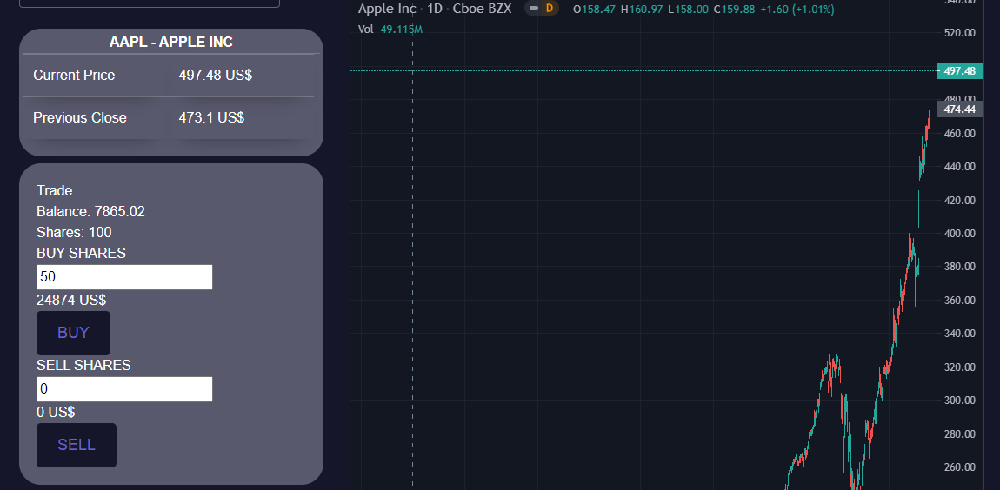
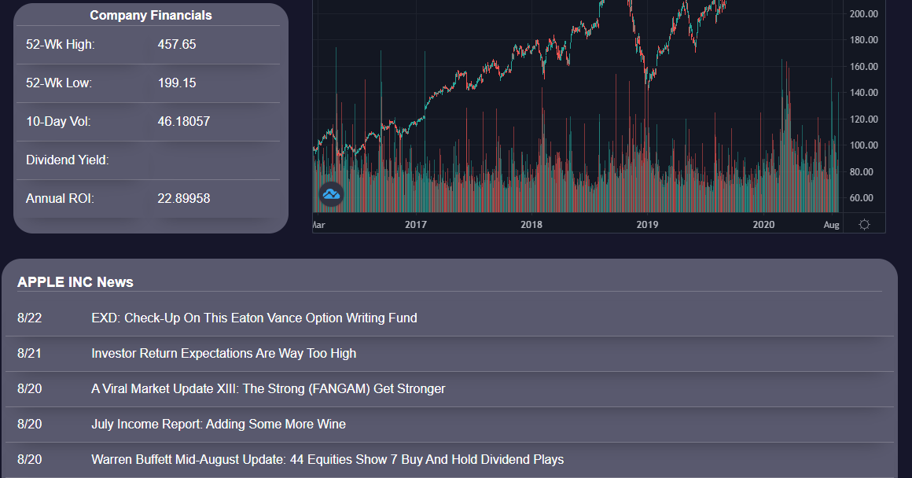
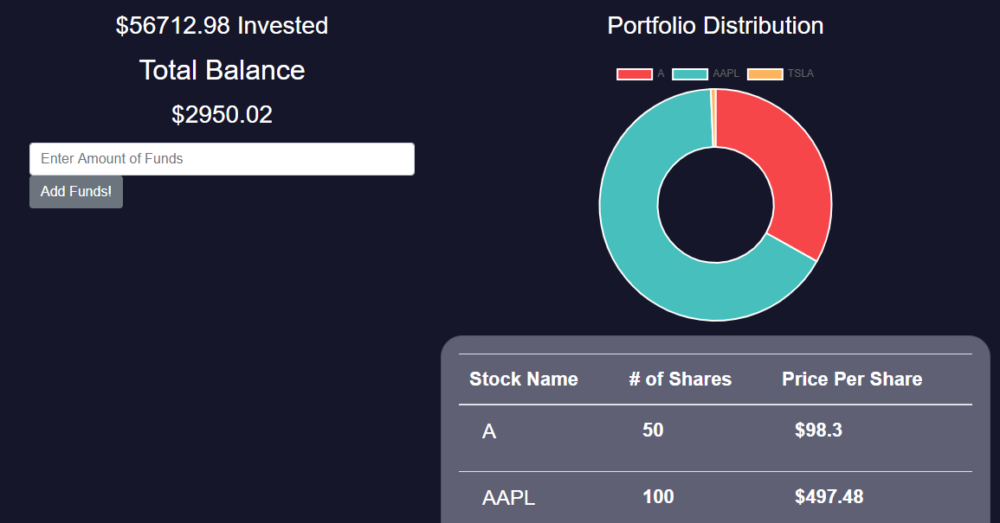

# Employee Management System

## Description 
This is Project 3, a stock management system called BOL$A.

## Table of Contents 
[Installation](#installation)

[Usage](#usage)

[License](#license)

[Contributing](#contributing)

[Tests](#tests)

[Questions](#questions)
## Installation
Download the source code, then in the top folder (with server.js) run "npm install". 

## Usage
In the top folder (with server.js) run "npm start". Alternately go to the deployed page https://bolsa-tober65.herokuapp.com/. 

On the sign up page enter a username, email, and password, then login with your email and password. On the Dashboard page you will see recent market news. Go to the portfolio page to add funds before buying stocks.

On the portfolio page you can add funds to your balance. These funds will be tracked as you buy and sell stocks. Go back to the dashboard page to search for and buy stocks.

On the dashboard page you can search for stocks by symbol or company name. You can buy stocks with your avaiable balance, or sell stocks you already own. When a company is selected you can see current market data for the company on this page. To view a summary of your portfolio go back to the profie page.

## License
This is licensed under the [MIT license](https://choosealicense.com/licenses/mit/).

## Contributing
Feel free to contribute

## Tests
No tests at the moment

## Questions
Email: timothy.ober@gmail.com, Mattyihyun@gmail.com, lindy.merwin@gmail.com, chrisgshred@gmail.com